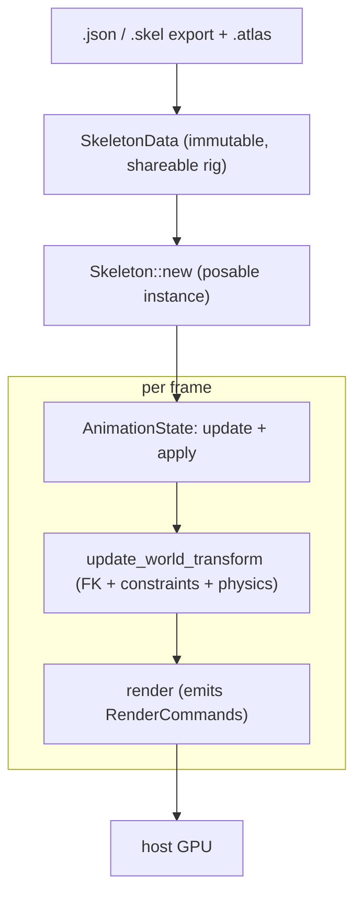

# chine

A pure-Rust [Spine](https://esotericsoftware.com/) 4.3 skeletal animation runtime, renderer-agnostic.

`chine` loads Spine skeleton exports (JSON or binary `.skel`) and a texture
atlas, poses and animates a skeleton (forward kinematics plus IK, transform,
path, physics, and slider constraints, with the full Spine 4.3 timeline set and
multi-track mixing), and emits renderer-agnostic draw data, leaving all GPU work
to the host engine.

It is a from-scratch reimplementation that references the official Spine 4.3
runtimes, and is **not** affiliated with or endorsed by Esoteric Software. Using
Spine skeleton data requires a valid
[Spine Editor license](https://esotericsoftware.com/spine-editor-license).

## Why

The established Rust runtime, `rusty_spine`, is transpiled from `spine-c` and
tops out at Spine 4.2; Esoteric discontinued `spine-c` at 4.3. `chine` is a
from-scratch, dependency-light (`glam` plus optional `serde`) implementation of
the 4.3 runtime, so projects can target current Spine in pure Rust (native and
WebAssembly). The math is transcribed from the Spine 4.3 reference runtime for
fidelity.

(The name is the *chine*, the backbone.)

## Pipeline



## Usage

```rust
use std::sync::Arc;
use chine::anim::AnimationState;
use chine::atlas::Atlas;
use chine::render::{bind_atlas, render};
use chine::skel::Skeleton;

// Load once. Use `chine::binary::from_binary(&bytes)` for a `.skel` export.
let atlas = Atlas::parse(&atlas_text);
let mut data = chine::load::from_json(&skeleton_json)?;
bind_atlas(&mut data, &atlas); // resolve attachment UVs + atlas pages
let mut skeleton = Skeleton::new(Arc::new(data));

let walk = skeleton.data().find_animation("walk").unwrap().clone();
let mut state = AnimationState::new();
state.set_animation(walk, true); // loop

// Per frame.
state.update(dt);
skeleton.update(dt); // physics
skeleton.set_bones_to_setup_pose();
state.apply(&mut skeleton);
skeleton.update_world_transform();
let commands = render(&skeleton); // upload positions / uvs / triangles to your renderer
```

Each `RenderCommand` carries world-space vertex positions, page-normalized UVs,
triangle indices, a tint color, an optional dark (two-color) tint, an atlas page
index, and a blend mode. `chine` does no rendering itself; in a render loop,
prefer `render_into(&skeleton, &mut buffer)` to reuse one allocation per frame.

To sanity-check a real export end to end (load, pose, render), headlessly:

```sh
cargo run --example inspect -- skeleton.json atlas.atlas
```

## Implemented

`chine` implements the Spine 4.3 runtime feature set for loading, posing,
animating, and emitting draw data:

- **Loaders**: JSON (`.json`) and binary (`.skel`) skeleton exports; texture
  atlas (`.atlas`) parsing (the 4.1+ format plus common legacy keys).
- **Skeleton**: bones, slots, and skins; region, mesh (including weighted),
  path, bounding-box, point, clipping, and linked-mesh attachments; animated
  (flipbook) sequences.
- **Forward kinematics** with all five inherit modes.
- **Constraints**, ordered by a topological update cache:
  - **IK**: 1- and 2-bone solvers with softness, stretch, compress, and scale.
  - **Transform**: the 4.3 source-to-target property-mapping system.
  - **Path**: constant-speed Bezier arc-length sampling along a path attachment.
  - **Physics**: the 4.3 spring-damper simulation, with skeleton wind / gravity.
  - **Slider**: the 4.3 slider constraint.
- **Animation**: every timeline kind, with stepped / linear / Bezier curves:
  - bone rotate / translate / scale / shear, plus single-axis variants;
  - IK / transform / path / physics / slider mix timelines;
  - slot color / alpha / two-color / attachment-swap / draw-order;
  - deform, events, and sequences;
  - a multi-track `AnimationState` with crossfade mixing and an animation queue.
- **Rendering**: a renderer-agnostic `RenderCommand` stream, including two-color
  (tint-black) tinting and polygon clipping.

The loaders are validated against real exports (for example spineboy: 67 bones,
52 slots, 11 animations, 7 IK + 7 transform constraints) and a binary rig that
exercises sequences and clipping.

## Cargo features

Both loaders are on by default; disable either to trim dependencies or binary
size.

- `json` *(default)*: the `.json` skeleton loader (pulls `serde` / `serde_json`).
- `binary` *(default)*: the binary `.skel` loader (no extra dependencies).

With neither feature, `chine` is a manual pose / render runtime over a
hand-built `SkeletonData`.

## Web

[`chine-web`](chine-web/) (a workspace member) compiles `chine` to WebAssembly
and adds a WebGL2 backend plus a `<chine-spine>` custom element, so a Spine
animation renders in the browser. It also registers as `<spine-skeleton>`, a
drop-in for Spine's official HTML export. Build it with
[`wasm-pack`](https://rustwasm.github.io/wasm-pack/):

```sh
wasm-pack build chine-web --target web --release
```

See [`chine-web/README.md`](chine-web/README.md) for usage.

## Roadmap

`chine` covers the full Spine 4.3 runtime feature set; remaining work is
hardening and ergonomics:

- broader validation against more production exports;
- performance passes on the per-frame pose and draw paths;
- publishing to crates.io once the API has settled.

## License

Licensed under either of Apache License, Version 2.0 or the MIT license, at your
option. Using Spine skeleton data with `chine` still requires a valid Spine
Editor license and is subject to the
[Spine Runtimes License Agreement](https://github.com/EsotericSoftware/spine-runtimes/blob/4.3/LICENSE).
