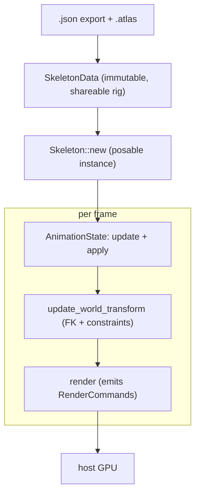

# chine

A pure-Rust [Spine](https://esotericsoftware.com/) 4.3 skeletal animation runtime, renderer-agnostic.

`chine` loads Spine skeleton exports and a texture atlas, poses and animates a
skeleton (forward kinematics plus IK, transform, and path constraints), and
emits renderer-agnostic draw data, leaving all GPU work to the host engine.

It is a clean-room reimplementation and is **not** affiliated with or endorsed
by Esoteric Software. Using Spine skeleton data requires a valid
[Spine Editor license](https://esotericsoftware.com/spine-editor-license).

## Why

The established Rust runtime, `rusty_spine`, is transpiled from `spine-c` and
tops out at Spine 4.2; Esoteric discontinued `spine-c` at 4.3. `chine` is a
from-scratch, dependency-light (`glam` plus optional `serde`) implementation of
the 4.3 runtime, so projects can target current Spine in pure Rust. The math is
transcribed from the Spine 4.3 reference runtime for fidelity.

(The name is the *chine*, the backbone.)

## Pipeline



## Usage

```rust
use std::sync::Arc;
use chine::anim::AnimationState;
use chine::atlas::Atlas;
use chine::render::{bind_atlas, render};
use chine::skel::Skeleton;

// Load once.
let atlas = Atlas::parse(&atlas_text);
let mut data = chine::load::from_json(&skeleton_json)?;
bind_atlas(&mut data, &atlas); // resolve attachment UVs + atlas pages
let mut skeleton = Skeleton::new(Arc::new(data));

let walk = skeleton.data().find_animation("walk").unwrap().clone();
let mut state = AnimationState::new();
state.set_animation(walk, true); // loop

// Per frame.
state.update(dt);
skeleton.set_bones_to_setup_pose();
state.apply(&mut skeleton);
skeleton.update_world_transform();
let commands = render(&skeleton); // upload positions / uvs / triangles to your renderer
```

Each `RenderCommand` carries world-space vertex positions, page-normalized UVs,
triangle indices, a tint color, an atlas page index, and a blend mode. `chine`
does no rendering itself.

To sanity-check a real export end to end (load, pose, render), headlessly:

```sh
cargo run --example inspect -- skeleton.json atlas.atlas
```

## Implemented

- Spine `.json` skeleton loader: bones, slots, skins, and region / mesh / path
  attachments (including weighted meshes).
- Texture atlas (`.atlas`) parsing: the 4.1+ format plus common legacy keys.
- Forward kinematics with all five inherit modes.
- Animation: rotate / translate / scale timelines, stepped / linear / Bezier
  curve interpolation, and a single-track `AnimationState`.
- Constraints, ordered by a topological update cache:
  - **IK**: 1- and 2-bone solvers with softness, stretch, compress, and scale
    modes.
  - **Transform**: the 4.3 source-to-target property-mapping system.
  - **Path**: constant-speed Bezier arc-length sampling along a path attachment.
- Constraint timelines: animate IK / transform / path mix values.
- A renderer-agnostic `RenderCommand` draw stream.

The loader is validated against real exports (for example spineboy: 67 bones,
52 slots, 11 animations, 7 IK + 7 transform constraints).

## Cargo features

- `json` *(default)*: the `.json` skeleton loader (`serde` / `serde_json`).
- `binary`: placeholder for the forthcoming `.skel` loader.

## Roadmap

- Physics constraints (the 4.3 spring-damper simulation).
- Binary `.skel` loader.
- Multi-track `AnimationState` mixing (crossfades and the animation queue).
- Clipping attachments.
- Rotated-region mesh UVs; slot color / attachment / draw-order timelines.

## License

Licensed under either of Apache License, Version 2.0 or the MIT license, at your
option.
