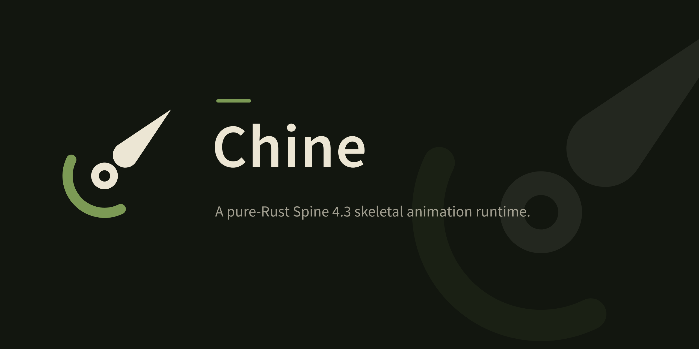
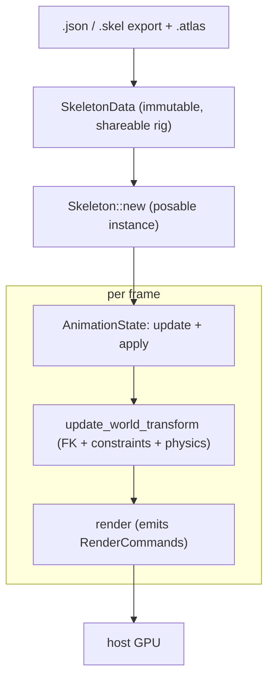

<p align="center">
  
</p>

A pure-Rust [Spine](https://esotericsoftware.com/) 4.3 skeletal animation runtime, renderer-agnostic.

`chine` loads Spine skeleton exports (JSON or binary `.skel`) and a texture
atlas, poses and animates a skeleton (forward kinematics plus IK, transform,
path, physics, and slider constraints, with the full Spine 4.3 timeline set and
multi-track mixing), and emits renderer-agnostic draw data, leaving all GPU work
to the host engine.

It is a from-scratch reimplementation that references the official Spine 4.3
runtimes, and is **not** affiliated with or endorsed by Esoteric Software. Using
Spine skeleton data requires a valid
[Spine Editor license](https://esotericsoftware.com/spine-editor-license).

## Why

The established Rust runtime, `rusty_spine`, is transpiled from `spine-c` and
tops out at Spine 4.2. Esoteric discontinued `spine-c` at 4.3. `chine` is a
from-scratch, dependency-light (`glam` plus optional `serde_json`)
implementation of the 4.3 runtime, so projects can target current Spine in pure
Rust (native and WebAssembly). It reproduces the official runtime's behavior. It
does not port or copy the official code.

(The name is the *chine*, the backbone.)

## Pipeline



## Usage

```rust
use std::sync::Arc;
use chine::anim::AnimationState;
use chine::atlas::Atlas;
use chine::render::{bind_atlas, render};
use chine::skel::Skeleton;

// Load once. Use `chine::binary::from_binary(&bytes)` for a `.skel` export.
let atlas = Atlas::parse(&atlas_text);
let mut data = chine::load::from_json(&skeleton_json)?;
bind_atlas(&mut data, &atlas); // resolve attachment UVs + atlas pages
let mut skeleton = Skeleton::new(Arc::new(data));
// For a rig with named skins. A skin's skin-required bones and constraints,
// and the deform and sequence keys that name it, apply only while it is set.
skeleton.set_skin("goblin");

let walk = skeleton.data().find_animation("walk").unwrap().clone();
let mut state = AnimationState::new();
state.set_animation(walk, true); // loop

// Per frame.
state.update(dt);
skeleton.update(dt); // physics
skeleton.set_bones_to_setup_pose();
state.apply(&mut skeleton);
skeleton.update_world_transform();
let commands = render(&skeleton); // upload positions / uvs / triangles to your renderer
```

Each `RenderCommand` carries world-space vertex positions, page-normalized UVs,
triangle indices, a tint color, an optional dark (two-color) tint, an atlas page
index, and a blend mode. `chine` does no rendering itself. In a render loop,
use `render_into(&skeleton, &mut buffer)` to reuse one allocation per frame.

To sanity-check a real export end to end (load, pose, render), headlessly:

```sh
cargo run --example inspect -- skeleton.json atlas.atlas
```

## Implemented

`chine` implements the Spine 4.3 runtime feature set for loading, posing,
animating, and emitting draw data:

- **Loaders**: JSON (`.json`) and binary (`.skel`) skeleton exports, and
  texture atlas (`.atlas`) parsing (the 4.1+ format plus common legacy keys).
- **Skeleton**: bones, slots, and skins, with skin-required bones and
  constraints that apply only while a skin lists them. Region, mesh
  (including weighted), path, bounding-box, point, clipping, and linked-mesh
  attachments. Animated (flipbook) sequences.
- **Forward kinematics** with all five inherit modes.
- **Constraints**, ordered by a topological update cache:
  - **IK**: 1- and 2-bone solvers with softness, stretch, compress, and scale.
  - **Transform**: the 4.3 source-to-target property-mapping system.
  - **Path**: Bezier sampling along the path attachment a slot shows, by arc
    length or, for a path without constant speed, by its exported curve lengths.
  - **Physics**: the 4.3 spring-damper simulation, with skeleton wind / gravity.
  - **Slider**: the 4.3 slider constraint.
- **Animation**: every timeline kind, with stepped / linear / Bezier curves:
  - bone rotate / translate / scale / shear, plus single-axis variants and
    inherit-mode keys
  - IK / transform / path / physics / slider mix timelines
  - slot color / alpha / two-color / attachment-swap / draw-order, and the
    draw order of slot folders
  - deform, events, and sequences
  - a multi-track `AnimationState` with crossfade mixing and an animation queue
- **Rendering**: a renderer-agnostic `RenderCommand` stream, including two-color
  (tint-black) tinting and polygon clipping, with convex and inverse clips.

The loaders are validated against real exports (for example spineboy: 67 bones,
52 slots, 11 animations, 7 IK + 7 transform constraints) and a binary rig that
exercises sequences and clipping.

To check both loaders against the official Spine 4.3 example rigs, put their
`.json` and `.skel` exports in `data/examples/` (coin-pro, diamond-pro,
mix-and-match-pro, raptor-pro, spineboy-pro, stretchyman-pro, tank-pro, and
vine-pro). `cargo test` then loads each rig from both formats and requires the
same bones and the same pose for every animation and skin. The directory is
gitignored.

## Cargo features

Both loaders are on by default. Disable either to trim dependencies or binary
size.

- `json` *(default)*: the `.json` skeleton loader (pulls in `serde_json`).
- `binary` *(default)*: the binary `.skel` loader (no extra dependencies).

With neither feature, `chine` is a manual pose / render runtime over a
hand-built `SkeletonData`.

## Web

[`chine-web`](chine-web/) (a workspace member) compiles `chine` to WebAssembly
and adds a WebGL2 backend plus a `<chine-spine>` custom element, so a Spine
animation renders in the browser. It also registers as `<spine-skeleton>`, a
drop-in for Spine's official HTML export. Build it with
[`wasm-pack`](https://rustwasm.github.io/wasm-pack/):

```sh
wasm-pack build chine-web --target web --release
```

See [`chine-web/README.md`](chine-web/README.md) for usage.

## Untrusted input

A malformed `.skel`, JSON export, or atlas returns an error or loads as
harmless data. It does not panic, hang, or allocate without bound. The same
holds for the times, speeds, and scales a host passes in. [`fuzz/`](fuzz/)
has the cargo-fuzz targets that check this.

## Roadmap

`chine` covers the full Spine 4.3 runtime feature set. The remaining work:

- broader validation against more production exports
- performance passes on the per-frame pose and draw paths
- publishing to crates.io once the API has settled

[`CHANGELOG.md`](CHANGELOG.md) lists the changes in each version.

## Attribution

[Spine](https://esotericsoftware.com/) is a 2D skeletal animation tool and
runtime created by [Esoteric Software](https://esotericsoftware.com/). `chine`
is an independent, from-scratch reimplementation of the Spine 4.3 runtime. Its
file formats, posing math, and constraint behavior are based on Esoteric
Software's official
[spine-runtimes](https://github.com/EsotericSoftware/spine-runtimes), which were
referenced throughout development. All credit for the Spine format and runtime
design belongs to Esoteric Software. Spine is a trademark of Esoteric Software.
`chine` is an unaffiliated project and is not endorsed by them.

## License

`chine`'s own source code is licensed under the MIT license. See
[`LICENSE`](LICENSE).

`chine` is a from-scratch reimplementation of the Spine Runtimes and is not
affiliated with Esoteric Software. Using it to work with Spine skeleton data is
subject to the
[Spine Runtimes License Agreement](https://esotericsoftware.com/spine-editor-license),
which requires that each user hold a valid Spine Editor license. The full
agreement is reproduced in [`LICENSE`](LICENSE).
