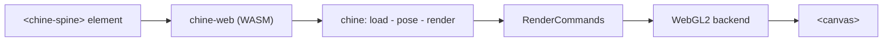

# chine-web

A WebAssembly + WebGL2 web-component runtime for [chine](../), the pure-Rust
Spine 4.3 runtime. It renders a Spine animation in the browser with a custom
element, as a lightweight drop-in for Spine's official HTML export.

chine stays renderer-agnostic; this crate compiles it to WebAssembly and adds
the only web-specific pieces: a WebGL2 backend for chine's `RenderCommand`
stream and a custom element that loads the assets and runs the animation loop.



## Build

Requires the `wasm32-unknown-unknown` target and
[`wasm-pack`](https://rustwasm.github.io/wasm-pack/):

```sh
wasm-pack build chine-web --target web --release
```

This writes the `pkg/` module (`chine_web.js` + `chine_web_bg.wasm`) that the
element imports. The default build loads binary `.skel` only; add
`-- --features json` for JSON exports (it pulls in serde_json and enlarges the
wasm).

## Use it by URL

Serve the skeleton (`.skel` or `.json`), its `.atlas`, and the atlas page
images alongside the page, then:

```html
<script type="module" src="chine-web/js/chine-spine.js"></script>
<chine-spine
  atlas="diamond-pro.atlas"
  skeleton="diamond-pro.skel"
  animation="idle-rotating"
  style="width:600px;height:600px"
></chine-spine>
```

The skeleton type (binary or JSON) is auto-detected; JSON needs a
`--features json` build. The skeleton is auto-fit and centered in the element.

## Drop in for a Spine HTML export

A Spine "Export → HTML" file embeds its data as base64 globals
(`skeletonData`, `atlasData`, `textureData`) and drives a `<spine-skeleton>`
element with a bundled spine-webgl runtime. To render it with chine instead,
replace that runtime `<script>` with this module:

```html
<script type="module" src="chine-web/js/chine-spine.js"></script>
```

chine-web registers under `<spine-skeleton>` as well as `<chine-spine>` and
reads the same embedded globals, so the export renders unchanged.

## Demos

- `examples/diamond.html`: the diamond rig loaded by URL.
- `examples/diamond-embedded.html`: a self-contained drop-in build (generated
  locally; embeds the rig's data).

Serve the crate directory and open a demo:

```sh
node chine-web/scripts/serve.js chine-web 8090
# then open http://localhost:8090/examples/diamond.html
```

Spine example rigs are not committed; provide your own assets under
`examples/`.
